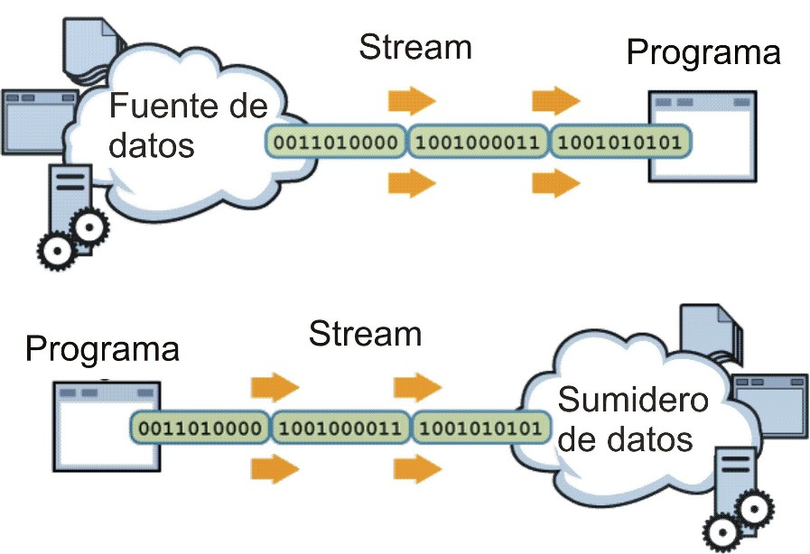
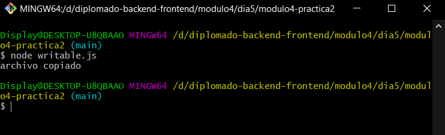
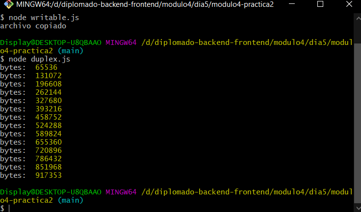
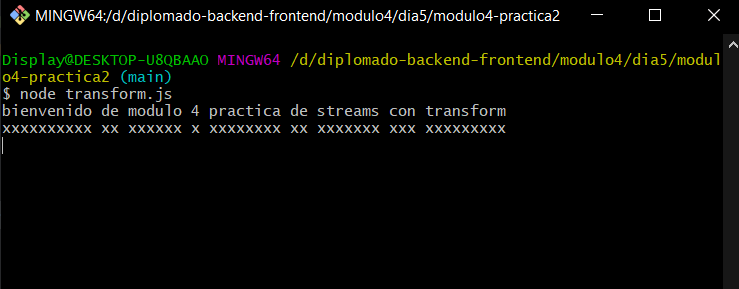


Desarrollar un ejemplo de uso de Streams en Node
=

### Node Documentacion de Streams
https://nodejs.org/api/stream.html

Desarrollar un ejemplo simple de uso de streams en node. Puede ser uno de los siguientes:
Para poder hacer uso de la potencia de los streams en NodeJS  solo tenemos que importar el módulo que viene con el núcleo de esta manera:
```sh
const stream = require('stream');
```
A partir de aquí, el módulo cuenta con 4 tipos de streams que podemos consumir:

- **Stream Readable**, Es una abstracción para consumir datos de un origen determinado.
    ```sh
    const Readable = require('stream').Readable;
    const rs = new Readable();

    rs.push('beep ');
    rs.push('boop\n');
    rs.push(null);


    rs.pipe(process.stdout);
    ```
- **Stream Writable**,Nos permite escribir un flujo de manera dinámica en un destino especificado.
    ```sh
    const Writable = require('stream').Writable;
    const myStream = new Writable();

    myStream.write('algun dato'); 
    myStream.write('algun dato mas'); 
    myStream.end('hecho escritura de dato');
    ```

    en el ejemplo usasermos writable.js

    ```sh
    node writable.js
    ```
    ejecucion de codigo la salida es la siguiente:
    
- **Stream Duplex**, Los streams duplex son aquellos que se comportan bien tanto para lectura como para escritura. En NodeJS existen varios de estos streams.
    ```sh
    a.pipe(b).pipe(a);
    ```

     en el ejemplo usasermos duplex.js

    ```sh
    node duplex.js
    ```
    ejecucion de codigo la salida es la siguiente:
    
- **Stream Transform**, Un stream transform es un caso específico de stream duplex. Es también un stream de lectura y escritura, con la diferencia que nos permite realizar transformaciones sobre la lectura o sobre la escritura.

    en el ejemplo usasermos transform.js

    ```sh
    node transform.js
    ```
    ejecucion de codigo la salida es la siguiente:
    
